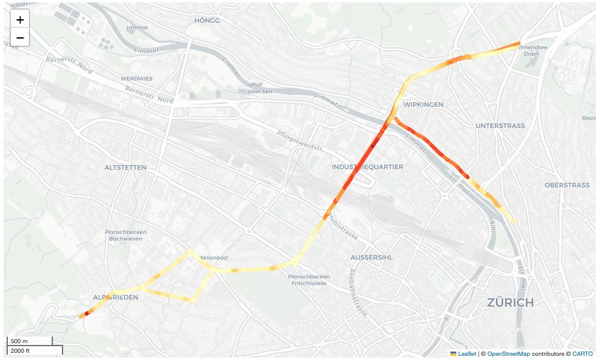

# Tempo-Exzesse auf Zürcher Strassen

Analyse von Geschwindigkeitsdaten auf drei von Zürichs umstrittensten Verkehrsachsen aus dem Januar 2021.  

## 0 Recherche-These
------------------------------------------------------------------------------------------------------------------------

- **These**: Tempo 30 und die damit verbundenen Bussen zeigen Wirkung.
- **Thesen-Check**: Die Tempo-30-Diskussion wird in Zürich sehr dogmatisch geführt. Es gibt zwar Studien, die basieren allerdings häufig auf theoretischen Rechenmodellen. Zudem hat das Thema Schnellfahrer im Zusammenhang mit dem Unfall am Escher-Wyss-Platz zusätzliche Relevanz erhalten. Initialaufwand relativ gross, allerdings kann der Code später für API-Abfrage und weitere Geschichten im Zusammenhang mit Tomtom-Daten wiederverwendet werden: Aufwandsschätzung 6 Tage. 
- **Knackpunkt**: Die Datenlage ist zu knapp, um wirklich valide Aussagen treffen zu können. 
- **Briefing-Person konsultieren**: Eine Vorbesprechung fand im Januar statt. Justierung des Recherche-Fokus und Dimension innerhalb des Teams. 

## 1 Daten-Quelle

Die niederländische Firma Tomtom ist eines der weitverbreitetsten Navigationssysteme weltweit: Tomtom schätzt, dass ihre Systemerund 20 Prozent des gesamten Autoverkehrs erfassen. Die Firma sammelt GPS-Daten und stellt sie in *aggregierter* Form für jeden Strassenabschnitt zur Verfügung. Ursprünglich stammen die Daten sowohl von portablen als auch von fest eingebauten Navigationsgeräten sowie Smartphones. **[Traffic-Stats-API](https://developer.tomtom.com/traffic-stats/documentation/api/introduction)**

### Probleme bei der Datenbeschaffung

Auch nach mehreren Monaten und unzähligen Versuchen der Kontaktaufnahme via Pressestelle, Developper-Tools und Support, wurde die **[Traffic-Stats-API](https://developer.tomtom.com/traffic-stats/documentation/api/introduction)** leider nicht geöffnet. 

Um trotzdem Daten zu Zürichs Strassen analysieren zu können, wurden die Daten mit einem Testzugang via **[Move-Portal](https://move.tomtom.com/register)** der Firma Tomtom beschafft. Ursprünglich war eine Analyse des gesamten Kantons Zürich vorgesehen. Allerdings können *via Move-Portal* nur maximal 20 Reports bezogen werden. Das machte eine Redimensionierung des Projektes notwendig. 

### Redimensionierung Recherche

Das machte eine redimensionierung des Projektes notwendig. Analysiert werden deshalb drei umstrittene Verkehrsachsen, die zuletzt politisch Anlass zu Diskussionen gaben: 

- Bucheggplatz via Rosengartenstrasse und Hardbrücke bis zum Albisriedenplatz. [(Seit Jahren ein Politikum](https://www.20min.ch/story/laerm-ueber-grenzwert-trotzdem-blockiert-kantonspolizei-tempo-30-442140576340) 
- Die Wasserwerkstrasse, wo bereits im Jahr 2021 Tempo 30 eingeführt wurde. [(Siehe Ergebnisse Wirkungsanalyse Tempo30](https://www.zh.ch/de/news-uebersicht/medienmitteilungen/2020/07/resultate-der-wirkungsanalyse-zu-tempo-30--liegen-vor.html#-782269903) 
- Die Albisriedenstrasse, [wo kürzlich innert kurzer Zeit 350 Autos geblitzt wurden](https://www.tagesanzeiger.ch/radar-blitzte-350-mal-an-einem-tag-949756423047).

## 2 Daten reinigen und analysieren

Für alle drei Strassen wurde der Zeitraum vom 1. Januar bis zum 31. Januar 2021 untersucht. Ausgewertet wurden nur Beobachtungen von Montag bis Freitag in den drei Zeitfenstern 0-6 Uhr, 6-12 Uhr, 12-18 Uhr sowie 18-24 Uhr (jeweils sechs Stunden). Nachts fahren deutlich weniger Autos als tagsüber, die Geschwindigkeiten sind dann meist auch höher. Gezeigt werden in der Regel nur die Zeitfenster 0-6 Uhr und 6-12 Uhr. Die Daten der  unterscheiden sich nur geringfügig von den Daten von 7-12 Uhr.

Pro Straßensegment lagen nicht die vollständigen Einzeldaten aller dort im Beobachtungszeitraum erfassten Autos vor, sondern nur **aggregierte Werte**, etwa die Anzahl der Hits pro Abschnitt und die dort gefahrene Durchschnittsgeschwindigkeit. Zusätzlich sind die erfassten Autos nach ihrer gefahrenen Geschwindigkeit in 20 Perzentile aufgeteilt.  

Es gibt eine Angabe zur Durchschnittsgeschwindigkeit der langsamsten 5 Prozent der Autos, zur Durchschnittsgeschwindigkeit der nächst schnelleren 5 Prozent der Autos und so weiter bis zur Durchschnittsgeschwindigkeit der schnellsten 5 Prozent der Autos. Aus diesen Angaben und dem verifizierten Speedlimit (Kameras in den Autos zeichnen pro Strassenabschnitt die angezeigte Geschwindigkeit auf) lässt sich leicht ableiten, wie hoch der Anteil der Autos in der Straße war, die beispielsweise mindestens 10 km/h schneller gefahren sind als erlaubt. Diese wurden zur Berechnung des **Anteil der Autos, die zu schnell fahren** genutzt und direkt ins Original-File geschrieben.

#### Erste Ergebnisse

So zeigen die ersten analysierten Daten für die untersuchten Strassen, dass auf der Hardbrücke in der Nacht jedes zweite Auto zu schnell unterwegs ist. Auch im Bereich der Wasserwerkstrasse sind sehr viele Autos in der 30er-Zone deutlich zu schnell unterwegs.

Die ursprünglichen Json-Fils wurden mit selbst programmierten Funktionen via Pandas und Geopandas zu neuen Files umgearbeitet, um sie auf eine interaktive Karte einzeichnen zu können. Für die 4 Time-Sets (siehe oben) und 2 Routen (Hin- und Rückweg) werden pro Verkehrsachse so insgesamt 8 Files generiert (insg. 24). Die verwendeten Libraries: *Pandas, Geopandas, shapely und fnmatch.*

**Die genauen Angaben und statistischen Annahmen können dem Notebook [2 Daten reinigen und analysieren](https://github.com/Aebermal/speed-kt-zh/blob/main/2%20Daten%20reinigen%20und%20analysieren.ipynb) entnommen werden**

#### Einschränkung

Schön wäre gewesen, die Daten-Segmentierung und Färbung direkt im File einzuzeichnen, um etwa mit einem externen Tool wie Data-Wrapper einzeichnen zu können. In der aktuellen Fassung der Daten wird das File als eine Linie eingezeichnet - ein kleiner Schönheitsfehler, den es im Weiteren zu beheben gilt. 

Eine bessere, genauere Granularität der Daten wäre erreicht worden, wenn die Segmente einzeln für jeden Tag abgefragt worden wären. Das wäre aber erst mit dem Zugriff auf die API möglich bzw. war mit der Beschränkung der 20 Reports nicht umsetzbar für die drei Verkehrsachsen.

### 2.1 Automatisierung

Die Ergebnisse aus den 8 Rosengarten-Files waren aussagekräftig und deshalb wurde der Code in ein Automatisierungsfile übertragen (unkommentiert). Dadurch dieses Notebook lassen sich die ursprünglichen *Json-Files* automatisiert in *Geojson-Files* konvertieren und ablegen. 

Die vollständige Automatisierung ist [hier](https://github.com/Aebermal/speed-kt-zh/blob/main/2.1_Automatisierung.ipynb) zu finden.

## 3 Erstellung interaktive Grafiken

Die ersten Ergebnisse der jeweiligen *Routen und Timesets* (insg. 24) wurden in einem ersten Schritt mit den Libraries *GeoPandas*, shapely, fnmatch, os, osmnx und matplotlib* auf eine Karte der Stadt gezeichnet und das Strassennetz gezeichnet. 

Die ersten Grafiken wurden auf das Strassennetz von Zürich gezeichnet, das via OpenStreetmap-API angezapft wurde (osmnx), die Daten aus dem Ursprungsfile wurden via crs angepasst und später in der Automatisierung ergänzt. 

Weil die einzelnen Segmente nicht auf die schnelle eingefärbt werden konnten, wurden für die Geschwindigkeits-Segmente mit *mcolors aus matplotlib* ein eigenes Farbschema programmiert. 

Damit der User alle Strassensegmente anschauen kann, wurden alle Strassensegmente der drei Verkehrsachsen in einer Karte via *GeoPandas.explore()* eingefügt. So lassen sich die drei Strassenabschnitte interaktiv erkunden. 

Die ganze Visualisierung und die einzelnen Routen lassen sich [hier](https://github.com/Aebermal/speed-kt-zh/blob/main/3%20Daten%20visualisieren.ipynb) anschauen.

## 4 Story-Line und weiteres Vorgehen

[PDF zur Storyline und dem weiteren Vorgehen bis zur Publikation.](https://github.com/Aebermal/speed-kt-zh/blob/main/4%Nächtliche%Tempo-Exzesse%auf%der%Hardbrücke.pdf)

## 5 Aufwandslogbuch 

- Einlesen in API-Dokumentation und Datenstruktur: 1 Std. 
- Datenbeschaffung via Move-Portal: 2 Std. 
- Datenreinigung, Segmentierung und Berechnungen: 24 Std. (inkl. Recherchen, Nachschlagen, ausbessern des Codes mit Funktionen)
- Visualisierung: 16 Std. (inkl. Recherche für interaktive Karte) 
- Texten der Story-Line: 1 Std. (nach Entscheid für Variante 2)
- **Total: 43 Stunden**

